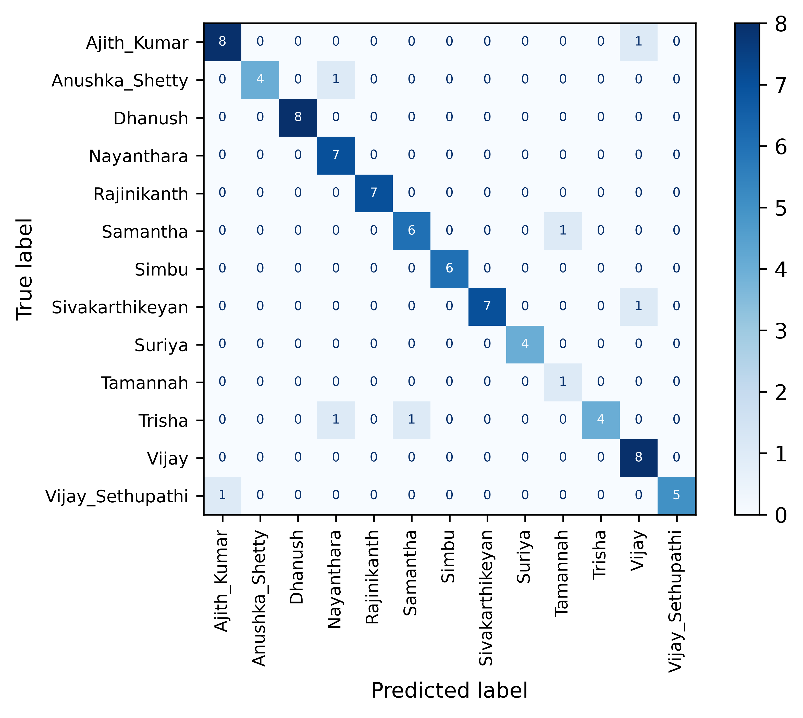
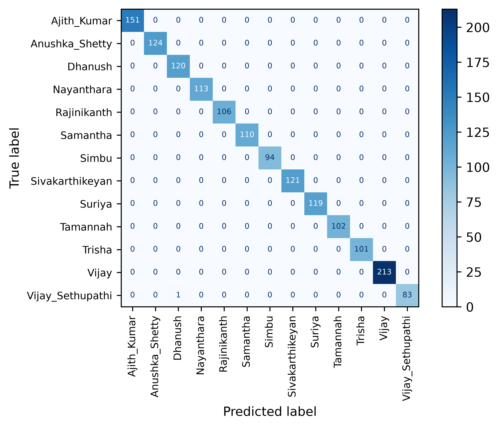

# Tamil Actor Classification using ConvNeXt Base

A Deep Learning project for classifying Tamil movie actors from images using PyTorch and ConvNeXt Base.

## Overview

This project identifies Tamil film actors from images using transfer learning on the ConvNeXt Base architecture.

The model was trained on a custom dataset containing images of 13 popular Tamil actors and actresses.

## Deployment

Deployed in streamlit, you can check [here](https://actor-classifier.streamlit.app/)

## Dataset

You can find the dataset for this project [here](https://www.kaggle.com/datasets/monishwarmc/southindianactorsimages)

## Classes

- Ajith Kumar
- Anushka Shetty
- Dhanush
- Nayanthara
- Rajinikanth
- Samantha
- Simbu
- Sivakarthikeyan
- Suriya
- Tamannah
- Trisha
- Vijay
- Vijay Sethupathi

## Model

### trained 4 models and ConvNext base performed bast of all

- TinyVGG
- Resnet 18
- ConvNeXt Tiny
- ConvNeXt Base

Architecture:

- ConvNeXt Base
- Transfer Learning
- PyTorch

## Performance

| Metric | Value |
|----------|----------|
| Classes | 13 |
| Best Test Accuracy | 92.05% |
| Framework | PyTorch |
| Optimizer | Adam |
| Loss Function | CrossEntropyLoss |

## Project Structure

```text
Actor-classifier/
│
├── Actor classifier/
│   ├── config.py
│   ├── dataSetup.py
│   ├── engine.py
│   ├── models.py
│   ├── utils.py
│   ├── train.py
│   ├── main.py
│   └── app.py
│
├── data/
├── cropped_faces/
├── testimg/
├── models/
│   └── ConvNextBase.pth
│
├── results/
│   ├── train_confusion_matrix.png
│   └── test_confusion_matrix.png
│
├── requirements.txt
├── .gitignore
└── README.md
```

## Installation

Clone the repository:

```bash
git clone https://github.com/monishwarmc/Actor-classifier.git
cd Actor-classifier
```

## Docker

Build the Docker image:

```bash
docker build -t actor-classifier .
```

Run the container:

```bash
docker run -p 8501:8501 actor-classifier
```

Open in your browser:

```text
http://localhost:8501
```

The application will start inside a Docker container and serve the Streamlit interface on port 8501.

### Dockerfile

```dockerfile
FROM python:3.12-slim

WORKDIR /app

COPY requirements.txt .

RUN pip install --no-cache-dir -r requirements.txt

COPY . .

EXPOSE 8501

CMD ["streamlit", "run", "Actor classifier/app.py", "--server.address=0.0.0.0", "--server.port=8501"]
```

## Training

Run:

```bash
python train.py
```

The best model will be saved automatically.

## Prediction

Place images inside:

```text
testimg/
```

Run:

```bash
python main.py
```

Example output:

```text
Vijay              99.14%
Ajith_Kumar         0.42%
Suriya              0.18%
```

## Features

- Transfer Learning
- ConvNeXt Base Architecture
- Early Stopping
- Top-3 Predictions
- Confusion Matrix Visualization
- Batch Image Prediction
- Custom Dataset Support

## Sample Results

### Test Accuracy

```text
92.05% with ConvNeXt Base model
```

## Confusion Matrix

<p align="center">
  
  
</p>

### Example Predictions

| Image | Prediction | Confidence |
|---------|---------|---------:|
| Vijay | Vijay | 99.14% |
| Ajith | Ajith Kumar | 99.28% |
| Anushka | Anushka Shetty | 99.86% |
| Samantha | Samantha | 99.80% |
| Vijay Sethupathi | Vijay Sethupathi | 99.75% |

## Future Improvements

- Larger dataset
- More actor classes
- Face detection using RetinaFace
- Web application using Flask/FastAPI
- Mobile deployment

## Technologies Used

- Python
- PyTorch
- TorchVision
- NumPy
- Pandas
- Matplotlib
- Scikit-Learn
- TorchMetrics
- OpenCV

## Author

Monishwar M C

Mechanical Engineer | AI & Machine Learning Enthusiast